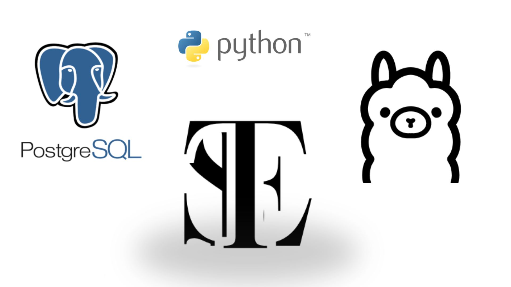

# 🧠 Proyecto de Salud Mental con IA | [](https://opensource.org/licenses/MIT)

  
_Ejemplo de interfaz del asistente de salud mental (reemplaza TES.jpg con tus capturas reales)_

## ✨ ¿Qué hace este proyecto?

Un asistente de IA que:

- ✅ Analiza el estado emocional mediante conversaciones naturales (usando Ollama).
- 📊 Almacena interacciones en PostgreSQL para seguimiento profesional.
- 🔄 Genera informes semanales de progreso.
- 🤖 Soporta múltiples modelos de IA (Llama 3, Mistral, etc.).

---

## 🛠️ Requisitos Técnicos

| Componente | Versión | Notas                            |
| ---------- | ------- | -------------------------------- |
| Python     | 3.10+   | Usar `pyenv` o Anaconda          |
| PostgreSQL | 15+     | Local o servicio cloud           |
| Ollama     | Latest  | [Instalación](https://ollama.ai) |
| RAM        | 8GB+    | Para modelos medianos de IA      |

---

## 🚀 Guía de Instalación Completa

### 1. Clonar y configurar entorno

```bash
git clone https://github.com/Esteban4-CRo/TES.git
cd TES
python -m venv venv
source venv/bin/activate  # Linux/Mac
venv\Scripts\activate     # Windows
```
